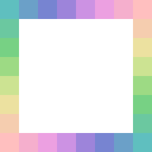

# ColorLab

## 1. 简介

一个渐变色的个人研究项目，纯C语言实现（使用了[miloyip前辈写的svpng](github.com/miloyip/svpng)来绘制png图），原理为线性插值。主要目标是用来生成好看的像素画配色方案，效果如下图所示（放大32倍）



## 2. 头文件

- **`ColorLab/inc/Base.h`**

  基础类型和函数

- **`ColorLab/inc/Bresenham.h`**

  用Bresenham法绘制像素直线的函数

- **`ColorLab/inc/Canvas.h`**

  画布模板类（用c语言实现模板看上去很复杂~）

- **`ColorLab/inc/Color.h`**

  颜色类，主要用于做RGB和HSV转换

- **`ColorLab/inc/DrawLine.h`**

  用Bresenham法和线性插值，在画布上绘制颜色渐变的直线

- **`ColorLab/inc/LinearInterpolation.h`**

  线性插值，目前包括对float、HSV、坐标的线性插值

- **`ColorLab/inc/svpng.inc`**

  [svpng](github.com/miloyip/svpng)

## 3. 源文件

- **`ColorLab/src/Base.c`**

  计算两点坐标距离的函数实现

- **`ColorLab/src/Bresenham.c`**

  Bresenham实现，[参考来源](github.com/miloyip/line)

- **`ColorLab/src/Color.c`**

  颜色类实现

- **`ColorLab/src/LinearInterpolation.c`**

  线性插值实现

- **`ColorLab/Main.c`**

  主函数
  
## 4. Canvas画布操作

### 4.1 定义和实现画布模板类

``` c
#define W 8 // 宽
#define H 8 // 高
#define D 3 // 深度, 3 = RGB, 4 = RGBA

Canvas_DEF(W, H, D);  // 定义模板
Canvas_IMPL(W, H, D); // 实现模板
```

### 4.2 初始化

``` c
// 定义画布, 坐标和颜色
Canvas(W, H, D) canvas;
Point p;
Color c;

// 初始化画布和颜色
Canvas(W, H, D, _Init) (&canvas);
Color_Init(&c);
```

### 4.3 设值，调用

``` c
p.x = 1; p.y = 2;
c.ops->SetRGBA(&c0, 255, 0,  0, 255); // 纯红
canvas.ops->Set(&canvas, p, &c);

// ...
```

### 4.4 保存

``` c
canvas.ops->Save(&canvas, "test.png"); // 保存画布
```


## 5. DrawLine画线使用方法

### 5.1 定义和实现画布模板类和画线模板函数

``` c
#define W 8 // 宽
#define H 8 // 高
#define D 3 // 深度, 3 = RGB, 4 = RGBA

Canvas_DEF(W, H, D);  DrawLine_DEF(Canvas(W, H, D));  // 定义模板
Canvas_IMPL(W, H, D); DrawLine_IMPL(Canvas(W, H, D)); // 实现模板
```

### 5.2 初始化

``` c
// 定义画布, 起点坐标p0, 终点坐标p1; 起点颜色c0, 终点颜色c1
Canvas(W, H, D) canvas;
Point p0, p1;
Color c0, c1;

// 初始化画布和颜色
Canvas(W, H, D, _Init) (&canvas);
Color_Init(&c0);
Color_Init(&c1);
```

### 5.3 设值，调用

``` c
// 设置起点颜色和终点颜色, 此处用HSV颜色空间模型表示
c0.ops->SetHSVA(&c0, 180, 50,  75, 255);
c1.ops->SetHSVA(&c1,   0, 25, 100, 255);

// 设置坐标画线
// 最后一个参数大于0时第一个颜色色相+360, 小于0时第一个颜色色相-360, 等于0时不进行色相修改操作
p0.x = 0; p0.y = 0;
p1.x = 0; p1.y = 7;
DrawLine(Canvas(W, H, D)) (&canvas, p0, p1, &c0, &c1, 0);

// ...
```

### 5.4 保存

``` c
canvas.ops->Save(&canvas, "test.png"); // 保存画布
```

